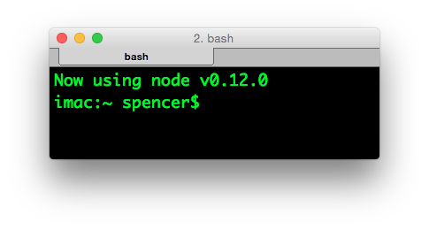

# Setup for Linux

Node.JS is very *nix friendly. Below I am demonstrating a setup that works on Ubuntu. You may need to tweak for other installations.


## Install a C++ Compiler

One of the powerful features of Node.JS is that it can use native C++ extensions. To be able to compile C++ code we are going to need to install some build tools:

```
sudo apt-get install build-essential libssl-dev curl git
```

## Install NVM

The [Node Version Manager](https://github.com/creationix/nvm) allows us to install and quickly switch between different versions of Node. In a new Terminal:

```
curl https://raw.githubusercontent.com/creationix/nvm/v0.24.1/install.sh | bash
```

Next you need to enable NVM:

```
source ~/.nvm/nvm.sh
```

Download the latest version of Node:

```
nvm install 0.12
```

And tell new shells to use nvm and Node 0.12:

```
echo -e '\n#Config for Intro to Node.JS\nsource ~/.nvm/nvm.sh\nnvm use 0.12\nexport NODE_ENV=development' >> ~/.bash_profile
```

If you have setup your system correctly, when you open a new Terminal window your should see the message, "Now using Node 0.12".

## Install Git

We will use Git to access code examples. The demo code repository is hosted on GitHub. If you don't have an account yet, [sign up for one](https://github.com/join).

## Install Atom

[Atom](https://atom.io/) is a free text editor designed by GitHub. Although, you can use any text editor to follow along on with the examples, I recommend you download and install Atom. I am going to configure a couple plugins to help us debug our code.

Follow [these instructions](https://github.com/atom/atom) to install the version of Atom right for your flavor of Linux.

After the shell commands have installed, we can add a few useful plugins to Atom. Open a new Terminal window and run:

```
apm install atom-beautify atom-handlebars jshint react
```

## Install NVM

The [Node Version Manager](https://github.com/creationix/nvm) allows us to install and quickly switch between different versions of Node. In a new Terminal:

```
curl https://raw.githubusercontent.com/creationix/nvm/v0.24.1/install.sh | bash
```

Next you need to enable NVM:

```
source ~/.nvm/nvm.sh
```

Download the latest version of Node:

```
nvm install 0.12
```

Tell new shells to use nvm and Node 0.12 on start up:

```
echo -e '\n#Config for Intro to Node.JS\nsource ~/.nvm/nvm.sh\nnvm use 0.12\nexport NODE_ENV=development' >> ~/.bash_profile
```

If you have setup your system correctly, when you open a new Terminal window your should see the message, "Now using Node 0.12".



## Install RoboMongo

[RoboMongo](http://robomongo.org/) is a cross-platform GUI client for MongoDB. It will help you see what you are doing in the database section.
