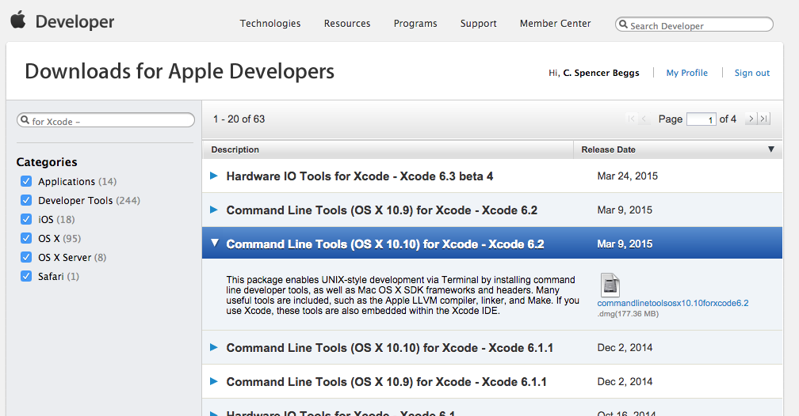

# Setup for OS X

Macs are great for developing Node.JS and most students who take this course bring Macs. OS X even comes with Node installed by default, but we are going to do a little extra work to make life a little easier during class.

All you need to be able to follow along during the lessons is a working installation of Node. If you can't complete one of the steps below (except installing Node itself), you should be able to run most of the example code.

## Update OS X

Before class you should update you version of OS X to the latest you can. [OS X 10.10 Yosemite](https://itunes.apple.com/us/app/os-x-yosemite/id915041082?mt=12) is available for free in the App Store.

If you already have Yosemite installed or are not updating to Yosemite, you should open the Mac App Store on your computer and update download any updates to your operating system version that Apple as made available.

## Install Xcode

One of the powerful features of Node.JS is that can use native C++ extentions. To be able to compile C++ code we are going to need some development tools.

[Xcode](https://itunes.apple.com/us/app/xcode/id497799835?mt=12) is Apple's free intergrated development evniornemnt (IDE). It is also available from the App Store and will install most of the tools we need.

Once you have installed Xcode, open the program and accept the license agreement.

Finally, you will need to install [Xcode's Command Line Tools](https://developer.apple.com/downloads/index.action?name=for%20Xcode%20-) from Apple's Developer Center. You will need to select the correct package from the list. Be sure to match your OS version and your Xcode version.



To test if you have Xcode install run the following command in your Terminal:

```
which make && which gcc
```

It should return:

```text
/usr/bin/make
/usr/bin/gcc
```
