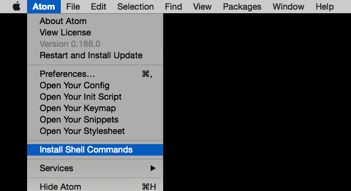

# Setup for Windows

Node.JS generally runs fine on Windows. Since there are many permutations of PC hardware and software, the instructions below are a generic way of installing a C++ compiler, Git, a text editor and Node.JS via the Node Version Manger for Windows.

## Install a C++ Compiler

One of the powerful features of Node.JS is that can use native C++ extensions. To be able to compile C++ code we are going to need some development tools.

You can quickly install build tools from the  [Win-builds](http://win-builds.org/1.5.0/win-builds-1.5.0.exe) package manager.

After you have installed Win-builds tell your shell to use the version you want. For 64-bit Windows:

```
echo 'source /opt/windows_64/bin/win-builds-switch >/dev/null' >> ~/.profile
```

For 32-bit Windows:

```
echo 'source /opt/windows_32/bin/win-builds-switch >/dev/null' >> ~/.profile
```

## Install Git

Download and [install Git](http://git-scm.com/download/win) from the official Git website.

We will use Git to access code examples. The demo code repository is hosted on GitHub. If you don't have an account yet, [sign up for one](https://github.com/join).

## Install Atom

[Atom](https://github.com/atom/atom/releases/latest) is a free text editor designed by GitHub. Although, you can use any text editor to follow along on with the examples, I recommend you download and install Atom. I am going to configure a couple plugins to help us debug our code.

After you have installed Atom, open the program, then open it's program drop-down menu and select "Install Shell Commands":



After the shell commands have installed, we can add a few useful plugins to Atom. Open a new Terminal window and run:

```
apm install atom-beautify atom-handlebars jshint react
```

## Install NVMW and the Latest Node.JS

The [Node Version Manager for Windows](https://github.com/creationix/nvm) allows us to install and quickly switch between different versions of Node. In a new Command Prompt:

```
git clone git://github.com/hakobera/nvmw.git "%HOMEDRIVE%%HOMEPATH%\.nvmw"

```

Activate nvmw by adding nvmw directory to your PATH environment variable:

```
set "PATH=%HOMEDRIVE%%HOMEPATH%\.nvmw;%PATH%"
```

Download the latest version of Node:

```
nvmw install 0.12.0
```
